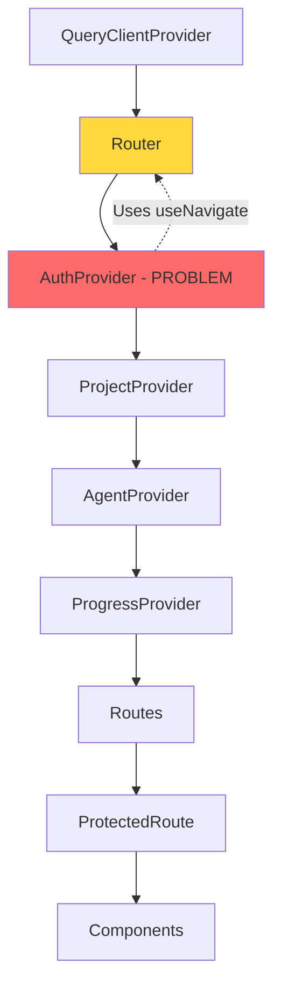
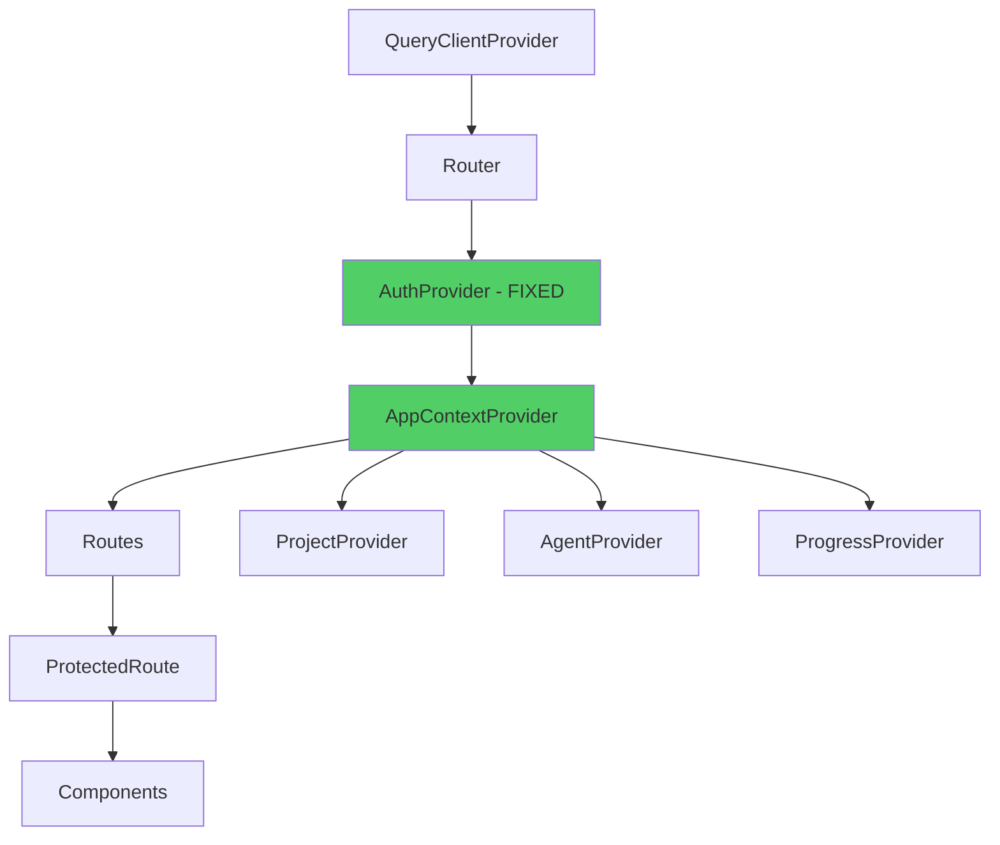

# Frontend Context Architecture Fix Design Document

## Overview

This design document outlines the solution for fixing the circular dependency issue in VentureBot's React context provider architecture. The current implementation causes infinite render loops because AuthContext uses navigation hooks while being placed outside the Router context. This design restructures the context hierarchy, eliminates circular dependencies, and ensures proper initialization order while maintaining all existing functionality and APIs.

## Architecture

### Current (Broken) Architecture



**Problem**: AuthProvider uses `window.location.href` for navigation but is nested inside Router, creating unnecessary complexity. Additionally, the deep nesting causes all contexts to re-render when any parent context updates.

### Fixed Architecture



**Solution**: 
1. AuthProvider stays inside Router but uses a navigation wrapper
2. Create a composite AppContextProvider that bundles ProjectProvider, AgentProvider, and ProgressProvider
3. Reduce nesting depth and improve re-render performance
4. Clear separation of concerns

## Components and Interfaces

### 1. Context Provider Hierarchy

**New App.tsx Structure:**

```typescript
function App() {
  return (
    <QueryClientProvider client={queryClient}>
      <Router>
        <AuthProvider>
          <AppContextProvider>
            <Routes>
              {/* Public Routes */}
              <Route path="/login" element={<Login />} />
              <Route path="/register" element={<Register />} />

              {/* Protected Routes */}
              <Route
                path="/*"
                element={
                  <ProtectedRoute>
                    <AppShell>
                      <AppRoutes />
                    </AppShell>
                  </ProtectedRoute>
                }
              />
            </Routes>
          </AppContextProvider>
        </AuthProvider>
      </Router>
    </QueryClientProvider>
  );
}
```

### 2. Enhanced AuthContext with Navigation Wrapper

**AuthContext Interface:**

```typescript
export interface AuthContextType {
  user: User | null;
  isAuthenticated: boolean;
  isLoading: boolean;
  login: (email: string, password: string) => Promise<void>;
  register: (name: string, email: string, password: string) => Promise<void>;
  logout: () => void;
  updateUser: (updates: Partial<User>) => void;
}

// Internal navigation wrapper
interface NavigationHelper {
  navigateTo: (path: string) => void;
  replace: (path: string) => void;
}
```

**Implementation Strategy:**

```typescript
// Use a custom hook that safely accesses navigation
const useAuthNavigation = (): NavigationHelper => {
  const navigate = useNavigate();
  
  return {
    navigateTo: (path: string) => {
      try {
        navigate(path);
      } catch (error) {
        // Fallback to window.location if navigate fails
        console.warn('Navigation hook failed, using window.location');
        window.location.href = path;
      }
    },
    replace: (path: string) => {
      try {
        navigate(path, { replace: true });
      } catch (error) {
        console.warn('Navigation hook failed, using window.location');
        window.location.replace(path);
      }
    },
  };
};
```

### 3. Composite AppContextProvider

**Purpose**: Bundle all application contexts into a single provider to reduce nesting and improve performance.

```typescript
interface AppContextProviderProps {
  children: ReactNode;
}

export const AppContextProvider = ({ children }: AppContextProviderProps) => {
  return (
    <ProjectProvider>
      <AgentProvider>
        <ProgressProvider>
          {children}
        </ProgressProvider>
      </AgentProvider>
    </ProjectProvider>
  );
};
```

**Benefits**:
- Single import for all app contexts
- Easier to manage context order
- Cleaner App.tsx
- Better performance through reduced nesting

### 4. Enhanced ProtectedRoute with Loading Coordination

**ProtectedRoute Interface:**

```typescript
interface ProtectedRouteProps {
  children: ReactNode;
  requireAuth?: boolean;
  fallback?: ReactNode;
}
```

**Implementation:**

```typescript
const ProtectedRoute = ({ 
  children, 
  requireAuth = true,
  fallback 
}: ProtectedRouteProps) => {
  const { isAuthenticated, isLoading: authLoading } = useAuth();
  const { isLoading: projectLoading } = useProject();
  const { isLoading: agentLoading } = useAgent();
  const { isLoading: progressLoading } = useProgress();
  const location = useLocation();

  // Coordinate all loading states
  const isLoading = authLoading || projectLoading || agentLoading || progressLoading;

  if (isLoading) {
    return fallback || (
      <div className="min-h-screen flex items-center justify-center bg-neutral-50">
        <div className="text-center">
          <Spinner size="lg" />
          <p className="mt-4 text-neutral-600">Loading your workspace...</p>
        </div>
      </div>
    );
  }

  if (requireAuth && !isAuthenticated) {
    return <Navigate to="/login" state={{ from: location }} replace />;
  }

  return <>{children}</>;
};
```

### 5. Error Boundary for Context Errors

**ContextErrorBoundary Component:**

```typescript
interface ContextErrorBoundaryProps {
  children: ReactNode;
  fallback?: ReactNode;
  onError?: (error: Error, errorInfo: React.ErrorInfo) => void;
}

interface ContextErrorBoundaryState {
  hasError: boolean;
  error: Error | null;
}

class ContextErrorBoundary extends React.Component<
  ContextErrorBoundaryProps,
  ContextErrorBoundaryState
> {
  constructor(props: ContextErrorBoundaryProps) {
    super(props);
    this.state = { hasError: false, error: null };
  }

  static getDerivedStateFromError(error: Error): ContextErrorBoundaryState {
    return { hasError: true, error };
  }

  componentDidCatch(error: Error, errorInfo: React.ErrorInfo) {
    console.error('Context Error:', error, errorInfo);
    this.props.onError?.(error, errorInfo);
  }

  handleReset = () => {
    this.setState({ hasError: false, error: null });
    window.location.href = '/';
  };

  render() {
    if (this.state.hasError) {
      return this.props.fallback || (
        <div className="min-h-screen flex items-center justify-center bg-neutral-50">
          <div className="max-w-md p-8 bg-white rounded-lg shadow-lg">
            <h2 className="text-2xl font-bold text-red-600 mb-4">
              Something went wrong
            </h2>
            <p className="text-neutral-600 mb-6">
              {this.state.error?.message || 'An unexpected error occurred'}
            </p>
            <button
              onClick={this.handleReset}
              className="w-full px-4 py-2 bg-blue-600 text-white rounded hover:bg-blue-700"
            >
              Return to Dashboard
            </button>
          </div>
        </div>
      );
    }

    return this.props.children;
  }
}
```

## Data Models

### 1. Context Initialization State

```typescript
interface ContextInitState {
  auth: 'idle' | 'loading' | 'ready' | 'error';
  project: 'idle' | 'loading' | 'ready' | 'error';
  agent: 'idle' | 'loading' | 'ready' | 'error';
  progress: 'idle' | 'loading' | 'ready' | 'error';
}

// Helper to check if all contexts are ready
const areContextsReady = (state: ContextInitState): boolean => {
  return Object.values(state).every(status => status === 'ready');
};
```

### 2. Navigation State

```typescript
interface NavigationState {
  isNavigating: boolean;
  from: string | null;
  to: string | null;
  error: Error | null;
}
```

### 3. Context Performance Metrics

```typescript
interface ContextMetrics {
  initTime: number;
  renderCount: number;
  lastUpdate: Date;
  errorCount: number;
}
```

## Correctness Properties

*A property is a characteristic or behavior that should hold true across all valid executions of a system-essentially, a formal statement about what the system should do. Properties serve as the bridge between human-readable specifications and machine-verifiable correctness guarantees.*

### Property 1: Context Initialization Order

*For any* application startup sequence, QueryClientProvider must initialize before Router, Router before AuthProvider, and AuthProvider before AppContextProvider
**Validates: Requirements 1.1, 1.2, 1.3, 1.4, 1.5**

### Property 2: No Circular Dependencies

*For any* context provider, it must not depend on a context that is initialized after it in the component tree
**Validates: Requirements 1.5, 2.1**

### Property 3: Navigation Availability

*For any* navigation action in AuthContext, the Router context must be available and initialized
**Validates: Requirements 2.1, 2.2, 2.3, 2.4**

### Property 4: Authentication Check Completeness

*For any* protected route access, authentication status must be fully determined before rendering protected content
**Validates: Requirements 3.1, 3.2, 3.3, 3.4**

### Property 5: State Persistence Round Trip

*For any* user session or project data, storing to localStorage and then loading from localStorage should produce equivalent state
**Validates: Requirements 4.1, 4.2, 4.3, 4.4**

### Property 6: Error Boundary Isolation

*For any* error thrown in a context provider, the error boundary must catch it without crashing the entire application
**Validates: Requirements 5.1, 5.2, 5.3, 5.4**

### Property 7: Hook Usage Validation

*For any* context hook called outside its provider, a descriptive error must be thrown immediately
**Validates: Requirements 6.1, 6.2, 6.3, 6.4, 6.5**

### Property 8: Loading State Coordination

*For any* combination of context loading states, the UI must show loading until all required contexts are ready
**Validates: Requirements 7.1, 7.2, 7.3, 7.4**

### Property 9: Selective Re-rendering

*For any* context state update, only components consuming that specific context should re-render
**Validates: Requirements 8.1, 8.2, 8.3, 8.4**

### Property 10: API Compatibility

*For any* existing component using context hooks, the hook interface and return values must remain unchanged after the fix
**Validates: Requirements 10.1, 10.2, 10.3, 10.4, 10.5**

## Error Handling

### 1. Context Initialization Errors

**Error Types:**
- `ContextInitializationError`: Failed to initialize a context provider
- `CircularDependencyError`: Detected circular dependency in context hierarchy
- `NavigationError`: Failed to navigate after auth action

**Handling Strategy:**
```typescript
try {
  // Initialize context
} catch (error) {
  if (error instanceof ContextInitializationError) {
    // Log error and show recovery UI
    console.error('Context initialization failed:', error);
    return <ContextErrorFallback error={error} onRetry={handleRetry} />;
  }
  throw error; // Let error boundary handle unexpected errors
}
```

### 2. Navigation Errors

**Fallback Strategy:**
```typescript
const safeNavigate = (path: string) => {
  try {
    navigate(path);
  } catch (error) {
    console.warn('React Router navigation failed, using window.location');
    window.location.href = path;
  }
};
```

### 3. Storage Errors

**Recovery Strategy:**
```typescript
const safeLoadFromStorage = <T>(key: string, defaultValue: T): T => {
  try {
    const item = localStorage.getItem(key);
    return item ? JSON.parse(item) : defaultValue;
  } catch (error) {
    console.error(`Failed to load ${key} from storage:`, error);
    return defaultValue;
  }
};
```

## Testing Strategy

### 1. Unit Testing

**Context Provider Tests:**
- Test each context provider in isolation
- Mock dependencies and verify initialization
- Test error handling and recovery
- Verify localStorage persistence

**Hook Tests:**
- Test each custom hook with React Testing Library
- Verify error messages when used outside provider
- Test state updates and side effects
- Verify memoization and performance optimizations

**Example Test:**
```typescript
describe('AuthContext', () => {
  it('should throw error when useAuth is called outside provider', () => {
    expect(() => {
      renderHook(() => useAuth());
    }).toThrow('useAuth must be used within an AuthProvider');
  });

  it('should restore session from localStorage on mount', async () => {
    localStorage.setItem('auth_token', 'mock-token');
    localStorage.setItem('user', JSON.stringify({ id: '1', email: 'test@example.com' }));

    const { result } = renderHook(() => useAuth(), {
      wrapper: ({ children }) => (
        <Router>
          <AuthProvider>{children}</AuthProvider>
        </Router>
      ),
    });

    await waitFor(() => {
      expect(result.current.isAuthenticated).toBe(true);
      expect(result.current.user?.email).toBe('test@example.com');
    });
  });
});
```

### 2. Integration Testing

**Context Hierarchy Tests:**
- Test complete context provider hierarchy
- Verify initialization order
- Test navigation flows
- Verify protected route behavior

**Example Test:**
```typescript
describe('Context Hierarchy', () => {
  it('should initialize all contexts in correct order', async () => {
    const initOrder: string[] = [];

    const TestAuthProvider = ({ children }: { children: ReactNode }) => {
      useEffect(() => {
        initOrder.push('auth');
      }, []);
      return <AuthProvider>{children}</AuthProvider>;
    };

    render(
      <QueryClientProvider client={queryClient}>
        <Router>
          <TestAuthProvider>
            <AppContextProvider>
              <div>Test</div>
            </AppContextProvider>
          </TestAuthProvider>
        </Router>
      </QueryClientProvider>
    );

    await waitFor(() => {
      expect(initOrder).toEqual(['auth']);
    });
  });
});
```

### 3. E2E Testing

**User Flow Tests:**
- Complete login/logout flow
- Protected route access
- Project creation and switching
- Agent selection and interaction
- Progress tracking updates

**Example Test:**
```typescript
test('user can login and access protected routes', async ({ page }) => {
  await page.goto('/login');
  
  await page.fill('input[name="email"]', 'test@example.com');
  await page.fill('input[name="password"]', 'password123');
  await page.click('button[type="submit"]');
  
  await page.waitForURL('/');
  expect(await page.textContent('h1')).toContain('Dashboard');
  
  // Verify contexts are loaded
  await expect(page.locator('[data-testid="user-menu"]')).toBeVisible();
  await expect(page.locator('[data-testid="project-selector"]')).toBeVisible();
});
```

## Performance Considerations

### 1. Context Optimization

**Memoization Strategy:**
```typescript
export const AuthProvider = ({ children }: AuthProviderProps) => {
  const [user, setUser] = useState<User | null>(null);
  const [isLoading, setIsLoading] = useState(true);

  // Memoize context value to prevent unnecessary re-renders
  const value = useMemo<AuthContextType>(
    () => ({
      user,
      isAuthenticated: !!user,
      isLoading,
      login,
      register,
      logout,
      updateUser,
    }),
    [user, isLoading] // Only recreate when these change
  );

  return <AuthContext.Provider value={value}>{children}</AuthContext.Provider>;
};
```

### 2. Selective Context Consumption

**Split Contexts by Concern:**
```typescript
// Instead of one large context, split into focused contexts
// Components only re-render when their specific context updates

// Bad: Single large context
interface AppContextType {
  user: User;
  projects: Project[];
  agents: Agent[];
  progress: Progress;
}

// Good: Separate focused contexts
interface AuthContextType {
  user: User;
  // ... auth-specific methods
}

interface ProjectContextType {
  projects: Project[];
  // ... project-specific methods
}
```

### 3. Lazy Context Initialization

**Defer Non-Critical Contexts:**
```typescript
// Load critical contexts immediately
const CriticalContexts = ({ children }: { children: ReactNode }) => (
  <AuthProvider>
    {children}
  </AuthProvider>
);

// Load non-critical contexts after initial render
const NonCriticalContexts = ({ children }: { children: ReactNode }) => (
  <ProjectProvider>
    <AgentProvider>
      <ProgressProvider>
        {children}
      </ProgressProvider>
    </AgentProvider>
  </ProjectProvider>
);
```

## Migration Strategy

### Phase 1: Create New Context Structure (No Breaking Changes)

1. Create `AppContextProvider` composite provider
2. Create `ContextErrorBoundary` component
3. Create navigation helper utilities
4. Add performance monitoring hooks
5. Write comprehensive tests

**Timeline**: 1-2 hours
**Risk**: Low (additive changes only)

### Phase 2: Update App.tsx (Breaking Change)

1. Restructure provider hierarchy in App.tsx
2. Wrap application in ContextErrorBoundary
3. Update AuthProvider to use navigation helper
4. Test all routes and navigation flows

**Timeline**: 1-2 hours
**Risk**: Medium (requires testing)

### Phase 3: Optimize and Monitor

1. Add performance monitoring
2. Optimize re-render behavior
3. Add development mode logging
4. Update documentation

**Timeline**: 1-2 hours
**Risk**: Low (optimization only)

### Rollback Plan

If issues occur:
1. Revert App.tsx to use App-minimal.tsx
2. Investigate specific context causing issues
3. Fix individual context in isolation
4. Re-apply changes incrementally

## Development and Debugging

### 1. Development Mode Logging

```typescript
const useContextLogger = (contextName: string, value: any) => {
  useEffect(() => {
    if (process.env.NODE_ENV === 'development') {
      console.log(`[${contextName}] Initialized:`, value);
    }
  }, []);

  useEffect(() => {
    if (process.env.NODE_ENV === 'development') {
      console.log(`[${contextName}] Updated:`, value);
    }
  }, [value]);
};
```

### 2. React DevTools Integration

```typescript
// Add display names for better DevTools experience
AuthProvider.displayName = 'AuthProvider';
ProjectProvider.displayName = 'ProjectProvider';
AgentProvider.displayName = 'AgentProvider';
ProgressProvider.displayName = 'ProgressProvider';
```

### 3. Performance Monitoring

```typescript
const useContextPerformance = (contextName: string) => {
  const renderCount = useRef(0);
  const initTime = useRef(Date.now());

  useEffect(() => {
    renderCount.current += 1;
    
    if (process.env.NODE_ENV === 'development') {
      console.log(`[${contextName}] Render #${renderCount.current}`);
      console.log(`[${contextName}] Time since init: ${Date.now() - initTime.current}ms`);
    }
  });
};
```

## Security Considerations

### 1. Token Storage

**Current Implementation**: Tokens stored in localStorage
**Security**: Acceptable for MVP, but consider httpOnly cookies for production

### 2. Context Data Exposure

**Consideration**: Context data is accessible to all child components
**Mitigation**: Only store non-sensitive data in contexts, fetch sensitive data on-demand

### 3. Error Message Sanitization

```typescript
const sanitizeError = (error: Error): string => {
  // Don't expose sensitive information in error messages
  if (error.message.includes('token') || error.message.includes('password')) {
    return 'Authentication error occurred';
  }
  return error.message;
};
```

## Accessibility

### 1. Loading State Announcements

```typescript
<div role="status" aria-live="polite" aria-atomic="true">
  {isLoading && <span className="sr-only">Loading your workspace...</span>}
</div>
```

### 2. Error Announcements

```typescript
<div role="alert" aria-live="assertive">
  {error && <span>{error.message}</span>}
</div>
```

## Documentation Updates

### 1. Context Usage Guide

Create documentation for developers:
- How to use each context
- When to create new contexts
- Performance best practices
- Common pitfalls to avoid

### 2. Architecture Diagram

Update architecture documentation with:
- New context hierarchy diagram
- Data flow diagrams
- Error handling flow
- Performance optimization guide

### 3. Migration Guide

Document the changes for team members:
- What changed and why
- How to update custom code
- Testing checklist
- Troubleshooting guide
