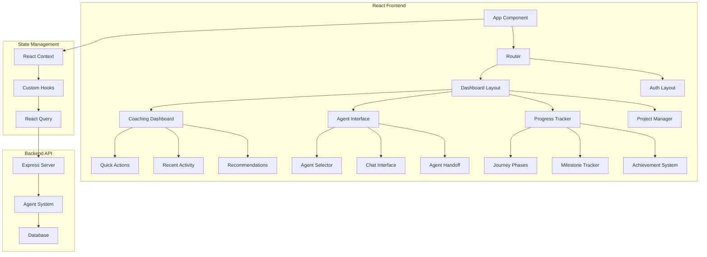

# Modern Frontend Upgrade Design Document

## Overview

This design document outlines the architecture and implementation approach for upgrading VentureBot's frontend from vanilla JavaScript to a modern React-based application with comprehensive multi-agent interface and progress tracking capabilities. The design focuses on creating a scalable, maintainable, and user-friendly coaching platform that aligns with the PRD's vision.

## Architecture

### High-Level Architecture



### Technology Stack

**Core Framework:**
- React 18 with TypeScript for type safety and better developer experience
- Vite for fast development and optimized builds
- React Router v6 for client-side routing

**State Management:**
- React Context API for global state (user, projects, current agent)
- Custom hooks for business logic encapsulation
- React Query (TanStack Query) for server state management and caching

**Styling & UI:**
- Tailwind CSS for utility-first styling and design system
- Headless UI for accessible, unstyled components
- Framer Motion for smooth animations and transitions
- Lucide React for consistent iconography

**Development Tools:**
- ESLint + Prettier for code quality
- Husky for git hooks
- Vitest for unit testing
- Playwright for e2e testing

## Components and Interfaces

### 1. Application Shell

**AppShell Component:**
```typescript
interface AppShellProps {
  children: React.ReactNode;
}

// Provides global layout, navigation, and context providers
// Handles authentication state and routing
// Manages global error boundaries and loading states
```

**Navigation Structure:**
- Dashboard (main coaching interface)
- Projects (project management and switching)
- History (conversation history by theme/agent)
- Settings (preferences and account)

### 2. Coaching Dashboard

**CoachingDashboard Component:**
```typescript
interface CoachingDashboardProps {
  currentProject: Project;
  onProjectSwitch: (projectId: string) => void;
}

// Central hub showing:
// - Current project status and phase
// - Recommended next actions
// - Recent agent interactions
// - Quick access to common tasks
// - Progress overview across all projects
```

**Dashboard Sections:**
- **Hero Section**: Current project overview with phase indicator
- **Quick Actions**: Context-aware action buttons (Validate Idea, Generate PRD, etc.)
- **Agent Recommendations**: Suggested agents based on current state
- **Recent Activity**: Timeline of recent interactions and milestones
- **Progress Overview**: Visual progress across journey phases

### 3. Multi-Agent Interface

**AgentInterface Component:**
```typescript
interface AgentInterfaceProps {
  currentAgent: Agent;
  availableAgents: Agent[];
  onAgentSwitch: (agentId: string) => void;
  sessionId: string;
}

// Manages agent selection, conversation, and handoffs
// Displays agent personality and specialization
// Handles real-time streaming responses
```

**Agent Selector:**
- Visual agent cards with specializations and availability
- Smart recommendations based on current context
- Agent personality indicators (colors, icons, descriptions)
- Handoff notifications when agents collaborate

**Chat Interface:**
- Real-time message streaming with typing indicators
- Message history with agent attribution
- Rich message formatting (markdown, code blocks, lists)
- Quick reply suggestions and action buttons

### 4. Progress Tracking System

**ProgressTracker Component:**
```typescript
interface ProgressTrackerProps {
  project: Project;
  journeyPhases: JourneyPhase[];
  milestones: Milestone[];
}

// Visualizes progress through entrepreneurship journey
// Tracks milestones and achievements
// Provides navigation between phases
```

**Journey Phase Visualization:**
```typescript
interface JourneyPhase {
  id: string;
  name: string;
  description: string;
  status: 'not_started' | 'in_progress' | 'completed';
  milestones: Milestone[];
  estimatedDuration: string;
  requiredAgents: string[];
}
```

**Progress Components:**
- **Phase Timeline**: Horizontal timeline showing all 7 phases
- **Milestone Tracker**: Detailed view of milestones within each phase
- **Achievement System**: Celebration animations and progress badges
- **Next Steps**: Contextual recommendations for progression

### 5. Project Management

**ProjectManager Component:**
```typescript
interface ProjectManagerProps {
  projects: Project[];
  currentProject: Project;
  onProjectCreate: () => void;
  onProjectSwitch: (projectId: string) => void;
  onProjectArchive: (projectId: string) => void;
}

// Manages multiple projects and ideas
// Provides project overview and switching
// Handles project lifecycle (create, archive, delete)
```

**Project Structure:**
```typescript
interface Project {
  id: string;
  name: string;
  description: string;
  currentPhase: JourneyPhase;
  progress: number; // 0-100
  createdAt: Date;
  lastActivity: Date;
  milestones: Milestone[];
  agents: AgentInteraction[];
  status: 'active' | 'paused' | 'completed' | 'archived';
}
```

### 6. Real-time Communication

**ChatStream Component:**
```typescript
interface ChatStreamProps {
  sessionId: string;
  agentId: string;
  onMessage: (message: Message) => void;
  onTyping: (isTyping: boolean) => void;
}

// Handles real-time message streaming
// Manages connection state and reconnection
// Provides typing indicators and message status
```

**Message Types:**
```typescript
interface Message {
  id: string;
  role: 'user' | 'assistant' | 'system';
  content: string;
  agentId?: string;
  timestamp: Date;
  status: 'sending' | 'sent' | 'delivered' | 'error';
  metadata?: {
    agent?: string;
    phase?: string;
    milestone?: string;
  };
}
```

## Data Models

### 1. User Context

```typescript
interface UserContext {
  user: User | null;
  currentProject: Project | null;
  projects: Project[];
  preferences: UserPreferences;
  isAuthenticated: boolean;
  isLoading: boolean;
}

interface UserPreferences {
  theme: 'light' | 'dark' | 'system';
  defaultAgent: string;
  notificationSettings: NotificationSettings;
  dashboardLayout: DashboardLayout;
}
```

### 2. Agent System

```typescript
interface Agent {
  id: string;
  name: string;
  description: string;
  specialization: string[];
  personality: AgentPersonality;
  availability: 'available' | 'busy' | 'offline';
  recommendedFor: JourneyPhase[];
}

interface AgentPersonality {
  color: string;
  icon: string;
  tone: string;
  expertise: string[];
}
```

### 3. Session Management

```typescript
interface Session {
  id: string;
  projectId: string;
  agentId: string;
  messages: Message[];
  context: SessionContext;
  createdAt: Date;
  lastActivity: Date;
}

interface SessionContext {
  currentPhase: string;
  memory: Record<string, any>;
  goals: string[];
  nextSteps: string[];
}
```

## Error Handling

### 1. Error Boundaries

**Global Error Boundary:**
- Catches React component errors
- Provides fallback UI with error reporting
- Logs errors for debugging

**API Error Handling:**
- Network error recovery with retry logic
- Graceful degradation for offline scenarios
- User-friendly error messages

### 2. Loading States

**Progressive Loading:**
- Skeleton screens for initial loads
- Optimistic updates for user actions
- Streaming indicators for real-time responses

**Connection Management:**
- WebSocket connection monitoring
- Automatic reconnection with exponential backoff
- Offline mode with local state persistence

## Testing Strategy

### 1. Unit Testing

**Component Testing:**
- React Testing Library for component behavior
- Mock API responses and user interactions
- Test accessibility and keyboard navigation

**Hook Testing:**
- Custom hook testing with React Hooks Testing Library
- State management logic validation
- Error handling scenarios

### 2. Integration Testing

**API Integration:**
- Mock Service Worker for API mocking
- End-to-end user flows
- Real-time communication testing

**Cross-browser Testing:**
- Modern browser compatibility
- Mobile device testing
- Performance benchmarking

### 3. E2E Testing

**User Journey Testing:**
- Complete onboarding flow
- Multi-agent conversations
- Project management workflows
- Progress tracking accuracy

## Performance Considerations

### 1. Code Splitting

**Route-based Splitting:**
- Lazy load dashboard and project components
- Agent-specific component bundles
- Progressive enhancement for advanced features

**Component-level Splitting:**
- Dynamic imports for heavy components
- Conditional loading based on user permissions
- Preloading for anticipated user actions

### 2. State Optimization

**React Query Caching:**
- Intelligent cache invalidation
- Background refetching for fresh data
- Optimistic updates for better UX

**Context Optimization:**
- Separate contexts for different concerns
- Memoization for expensive computations
- Selective re-rendering with React.memo

### 3. Real-time Performance

**Message Streaming:**
- Efficient WebSocket connection management
- Message batching for high-frequency updates
- Virtual scrolling for long conversations

**Memory Management:**
- Cleanup of event listeners and subscriptions
- Garbage collection of old messages
- Efficient data structures for large datasets

## Accessibility

### 1. WCAG Compliance

**Keyboard Navigation:**
- Full keyboard accessibility
- Focus management and visual indicators
- Skip links and navigation shortcuts

**Screen Reader Support:**
- Semantic HTML structure
- ARIA labels and descriptions
- Live regions for dynamic content

### 2. Inclusive Design

**Color and Contrast:**
- High contrast mode support
- Color-blind friendly palette
- Text alternatives for visual information

**Responsive Design:**
- Mobile-first approach
- Touch-friendly interactions
- Scalable text and UI elements

## Security Considerations

### 1. Authentication

**Token Management:**
- Secure token storage
- Automatic token refresh
- Session timeout handling

**API Security:**
- Request authentication headers
- CSRF protection
- Input validation and sanitization

### 2. Data Protection

**Sensitive Information:**
- Client-side encryption for sensitive data
- Secure transmission protocols
- Privacy-conscious logging

**User Privacy:**
- Granular privacy controls
- Data retention policies
- Consent management

## Migration Strategy

### 1. Incremental Migration

**Phase 1: Core Infrastructure**
- Set up React application shell
- Implement basic routing and authentication
- Create design system components

**Phase 2: Agent Interface**
- Migrate chat functionality to React
- Implement agent switching
- Add real-time streaming

**Phase 3: Progress Tracking**
- Build progress visualization components
- Implement milestone tracking
- Add achievement system

**Phase 4: Advanced Features**
- Project management interface
- Dashboard recommendations
- Mobile optimization

### 2. Backward Compatibility

**API Compatibility:**
- Maintain existing API contracts
- Gradual API evolution
- Feature flags for new functionality

**Data Migration:**
- Preserve existing user data
- Migrate conversation history
- Update data models incrementally

## Deployment and DevOps

### 1. Build Process

**Development:**
- Hot module replacement for fast development
- TypeScript compilation and type checking
- Automated testing on file changes

**Production:**
- Optimized bundle generation
- Asset compression and caching
- Source map generation for debugging

### 2. Monitoring

**Performance Monitoring:**
- Core Web Vitals tracking
- Bundle size monitoring
- Runtime performance metrics

**Error Tracking:**
- Client-side error reporting
- User session replay for debugging
- Performance bottleneck identification